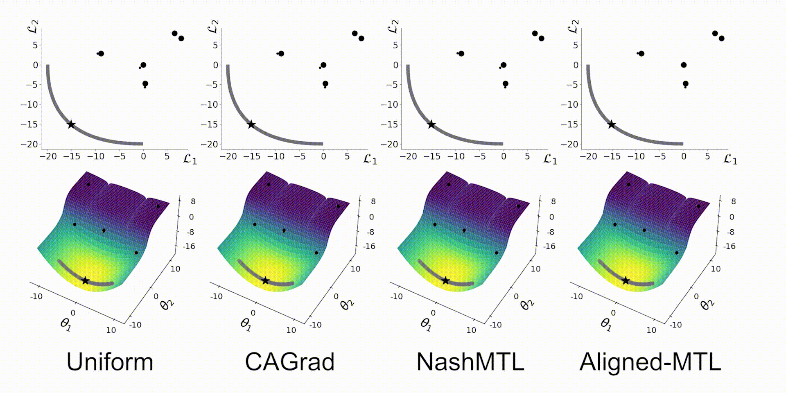

# [CVPR 2023] Independent Component Alignment for Multi-Task Learning

--- 

Dmitriy Senushkin, Nikolay Patakin, Arsneii Kuznetsov, Anton Konushin

[Paper](https://openaccess.thecvf.com/content/CVPR2023/papers/Senushkin_Independent_Component_Alignment_for_Multi-Task_Learning_CVPR_2023_paper.pdf) 
| [Supplementary](https://openaccess.thecvf.com/content/CVPR2023/supplemental/Senushkin_Independent_Component_Alignment_CVPR_2023_supplemental.pdf) 
| [Arxiv](https://arxiv.org/abs/2305.19000) 
| [Video](https://www.youtube.com/watch?v=mDSPJsrLu1g)

We introduce an Aligned-MTL - gradient optimization method for training multi-task neural networks. 
We address multi-task optimization issues by examining the stability of a gradient system as measured by its condition number. Using this criterion as a design principle, we present an Aligned-MTL method that eliminates instability in the training process by aligning the principal components of a gradient system. 

This is an official Pytorch implementation of the paper

## Installation

Besides `torch` installation, please ensure that the following libraries are installed:
    
    pip install scipy cvxpy matplotlib seaborn tqdm

## Data prepration

1) For NYU (3 task) benchmark please download data from this [link](https://www.dropbox.com/sh/86nssgwm6hm3vkb/AACrnUQ4GxpdrBbLjb6n-mWNa?dl=0) (~9GB, provided by [MTAN](https://github.com/lorenmt/mtan) repository). 
Unzip and specify `--data-path` path to a folder containing `train` and `val` subfolders.  

2) For Cityscapes (2 task) benchmark: [link](https://www.dropbox.com/sh/gaw6vh6qusoyms6/AADwWi0Tp3E3M4B2xzeGlsEna?dl=0).
Unzip and specify `--data-path` path to a folder containing `train` and `val` subfolders.

3) For Cityscapes (3 task) benchmark please refer to the original [Cityscapes](https://www.cityscapes-dataset.com/) benchmark website and
download the following files:

   - disparity_trainvaltest.zip (3.8 GB)
   - gtFine_trainvaltest.zip (250 MB)
   - leftImg8bit_trainvaltest.zip (11.6 GB)

    Unzip them into the same folder (as a result, should contain `leftImg8bit`, `disparity` and `gtFine`) 

## MTL methods

We provide implementations of several multi-task optimization methods. Gradient optimization method can 
be used during training by setting `--balancer` parameter to one of the following values: 

| Parameter value  | Method                                                                                                                                                                                  | Conference    |
|------------------|-----------------------------------------------------------------------------------------------------------------------------------------------------------------------------------------|---------------|
| `ls`             | Uniform weighting (aka linear scalarization)                                                                                                                                            | -             |
| `uncertainty`    | [Uncertainty weghting](https://arxiv.org/abs/1705.07115)                                                                                                                                | CVPR 2018     |
| `gradnorm`       | [Gradient normalization](https://arxiv.org/pdf/1711.02257.pdf)                                                                                                                          | ICML 2018     |
| `mgda`, `mgdaub` | [MGDA and MGDA-UB](https://arxiv.org/abs/1810.04650)                                                                                                                                    | NeurIPS 2018  |
| `dwa`            | [Dynamic Weight Average](https://arxiv.org/abs/1803.10704)                                                                                                                              | CVPR 2019     |
| `pcgrad`         | [Projecting Conflicting Gradients]( https://arxiv.org/pdf/2001.06782.pdf)                                                                                                               | NeurIPS 2020  |
| `graddrop`       | [Gradient Sign Dropout](https://arxiv.org/abs/2010.06808)                                                                                                                               | NeurIPS 2020  |
| `imtl`           | [Impartial Multi-Task Learning](https://openreview.net/forum?id=IMPnRXEWpvr)                                                                                                            | ICLR 2021     |
| `gradvac`        | [Gradient Vaccine](https://arxiv.org/abs/2010.05874)                                                                                                                                    | ICLR 2021     |
| `cagrad`         | [Conflict-Averse Gradient descent](https://arxiv.org/abs/2110.14048)                                                                                                                    | NeurIPS 2021  |
| `nash`           | [Nash-MTL](https://arxiv.org/abs/2202.01017)                                                                                                                                            | ICML 2022     |
| `rlw`            | [Random Loss Weighting](https://arxiv.org/abs/2111.10603) with normal distribution                                                                                                      | TMLR 2022     |
| `amtl`, `amtlub` | **Ours,** [Aligned-MTL and Aligned-MTL-UB](https://openaccess.thecvf.com/content/CVPR2023/papers/Senushkin_Independent_Component_Alignment_for_Multi-Task_Learning_CVPR_2023_paper.pdf) | **CVPR 2023** |

## Benchmarks

Our repository provides four benchmarks:

1. `cityscapes_pspnet` Cityscapes 3-task. PSPNet model. Semantic segmentation + Instance segmentation + Depth estimation
2. `cityscapes_mtan` Cityscapes 2-task. MTAN model. Semantic segmentation + Depth estimation
3. `nyuv2_pspnet` NYUv2 3-task. PSPNet model. Semantic segmentation + Depth estimation + Surface Normal Estimation
4. `nyuv2_mtan` NYUv2 3-task. MTAN model. Semantic segmentation + Depth estimation + Surface Normal Estimation

To run the training and evaluation code use (change parameter values according to your needs):

    python train.py --benchmark cityscapes_pspnet --balancer amtl --data-path /path/to/cityscapes

To compare methods on a synthetic two-task benchmark use:

    python optimize_toy.py --balancer amtl --scale 0.5

Scale parameter controls the balance between problems, i.e. L0 = scale * L1 + (1-scale) * L2. 
 

## Links

Our synthetic benchmark and visualisation code is based on the [NashMTL](https://github.com/AvivNavon/nash-mtl) repository.

## Citation

If you find our code repository or paper useful, please cite us:

    @InProceedings{Senushkin_2023_CVPR,
        author    = {Senushkin, Dmitry and Patakin, Nikolay and Kuznetsov, Arseny and Konushin, Anton},
        title     = {Independent Component Alignment for Multi-Task Learning},
        booktitle = {Proceedings of the IEEE/CVF Conference on Computer Vision and Pattern Recognition (CVPR)},
        month     = {June},
        year      = {2023},
        pages     = {20083-20093}
    }